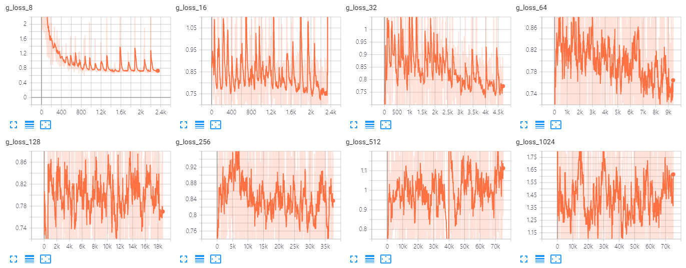
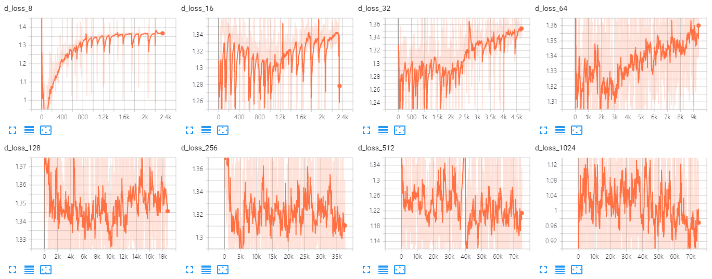

# StyleGAN-Tensorflow
**Simple & Intuitive** Tensorflow implementation of *"A Style-Based Generator Architecture for Generative Adversarial Networks"* **(CVPR 2019 Oral)**


<div align="center">
  
</div>

### [Official code](https://github.com/NVlabs/stylegan) | [Paper](https://arxiv.org/abs/1812.04948) | [Video](https://www.youtube.com/watch?v=kSLJriaOumA&feature=youtu.be) | [FFHQ Dataset](https://github.com/NVlabs/ffhq-dataset) 

## Other implementation
### [TF Estimator version](https://github.com/moono/stylegan-reproduced)

## Usage
```
├── dataset
   └── YOUR_DATASET_NAME
       ├── 000001.jpg 
       ├── 000002.png
       └── ...
```

### Train
```
> python main.py --dataset FFHQ --img_size 1024 --gpu_num 4 --progressive True --phase train
```

### Test
```
> python main.py --dataset FFHQ --img_size 1024 --progressive True --batch_size 16 --phase test
```

### Draw
#### Figure02 uncurated
```
python main.py --dataset FFHQ --img_size 1024 --progressive True --phase draw --draw uncurated
```

#### Figure03 style mixing
```
python main.py --dataset FFHQ --img_size 1024 --progressive True --phase draw --draw style_mix
```

#### Figure08 truncation trick
```
python main.py --dataset FFHQ --img_size 1024 --progressive True --phase draw --draw truncation_trick
```

## Architecture
<div align="center">
  
  
</div>

## Our Results (1024x1024)
* Training time: **2 days 14 hours** with **V100 * 4**
* **`max_iteration`** = **120**

### Uncurated
<div align="center">
  
</div>

### Style mixing
<div align="center">
  
</div>

### Truncation trick
<div align="center">
  
</div>

### Generator loss graph
<div align="center">
  
</div>

### Discriminator loss graph
<div align="center">
  
</div>

## Author
[Junho Kim](http://bit.ly/jhkim_ai)
